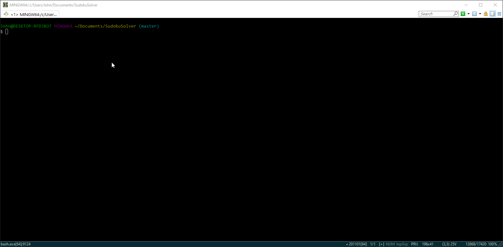

# SudokuSolver

A program that can solve any valid unfinished Sudoku.

Coming soon to your browser at: https://www.johnfarrell.dev/

# Instructions

`git clone https://github.com/JohnFarrellDev/SudokuSolver`

`python /path/sudokusolver.py .94...13..............76..2.8..1.....32.........2...6.....5.4.......8..7..63.4..8`
